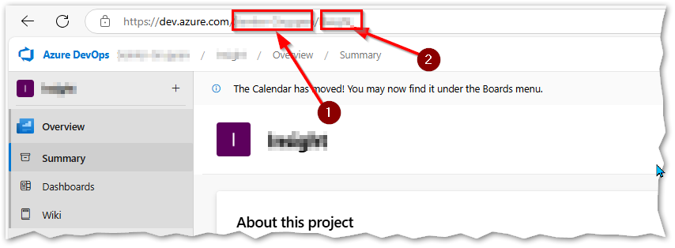
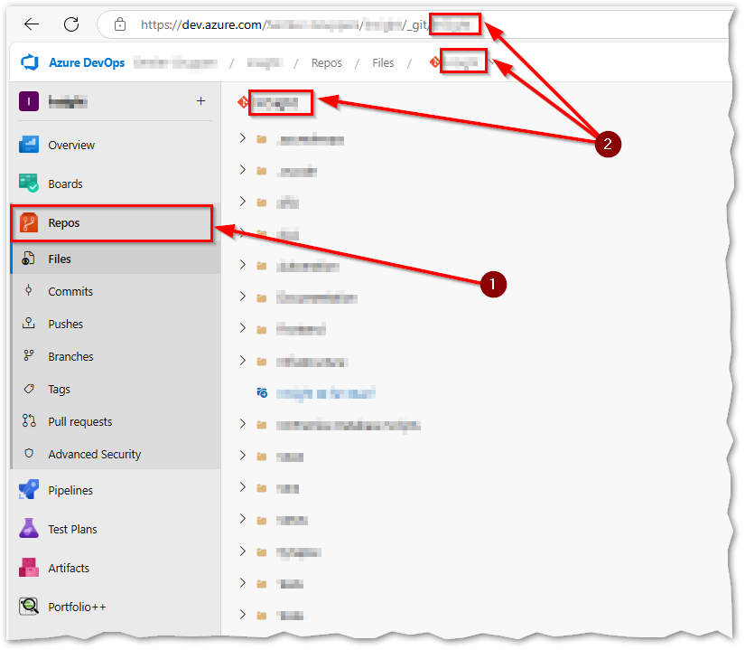
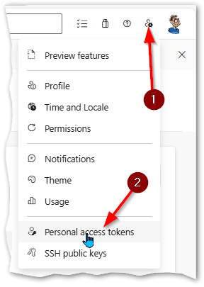

# Microsoft DevOps

Hos Semler bruger vi Microsoft DevOps til al vores projektering af udvikling i Group Data Analytics.

Når vi laver en release til produktion, så var det en ret tidskrævende process at finde ud af, hvad det var vi havde fået lagt i produktion.  
Derfor tænkte jeg, at dette da måtte kunne automatiseres, så efter en del forsøg, så kom jeg frem til

## Make Doc Great Again

Denne [notebook](./MakeDocGreatAgain.ipynb), tager egentlig to input man skal tilføje

```python
# Set the current and former release branch we like to compare
current_branch_name = 'releases/release/release_20250211_163813'
former_branch_name = 'release/release_2024W46'
```

Her tilføjer man så ens _seneste_ relesease, og så ens _forrige_ release, for at finde de forskelle de ligger i ens seneste release.

Denne og den anden [notebook](./UserStories.ipynb) bruger nogle settings og et `Personal Access Token` som man ikke umiddelbart vi dele med alle, da de så **også** kan læse fra ens DevOps miljø!  
Derfor er disse settings "gemt" i en `.env` som man så lige skal tilpasse ens miljø for at få det til at virke.

Denne `.env` fil skal ligge i roden af ens Python projekt og ser således ud:

```
ORG = 'Your Organisation'
PRJ = 'Your Project'
REP = 'Your Repository'
PAT = 'Your Personal Access Token'
```

De to første oplysninger finder du nemt i DevOps



Navnet på dit repository finder du her:  
Klik på:
1. Repos
2. Navnet på dit repository kan så aflæses her, bemærk at det kan være case-sensitivt



Dit Personal Access Token (PAT), det laver du selv her:  
1. Klik på `User Settings`
2. Klik på `Personal Access Token`



Klik så på `+ New Token`, giv det et navn, sæt længden på hvor længe dit token skal gælde, og for enkelthed, sæt `Scope` til `Full Acces`, og tryk `Create`.

Gem så dit nye token i `.env` filen

## User Stories

Mens jeg arbejdede på [`MakeDocGreatAgain.ipynb`](MakeDocGreatAgain.ipynb), så kom der et nyt interessant spørgsmål.  
I vores sprint, havde vi da User Stories der ikke have udfyldt User Acceptance Criteria?

Det er jo lidt svært at vide, hvornår er opgaven løst, hvis der ikke ligesom er et en accept kritere!

Så denne [notebook](UserStories.ipynb) er blot en ret "simpel" [notebook](UserStories.ipynb), der henter alle vores User Stories ud af DevOps, også så med vores filtre sat, for om en User Story er klar til at tage med i et sprint.

Denne [notebook](UserStories.ipynb), bruger også den før nævnte `.env` fil, eneste forskel er, at denne [notebook](UserStories.ipynb) ikke læser i repository, så den nøgle kan undlades.
